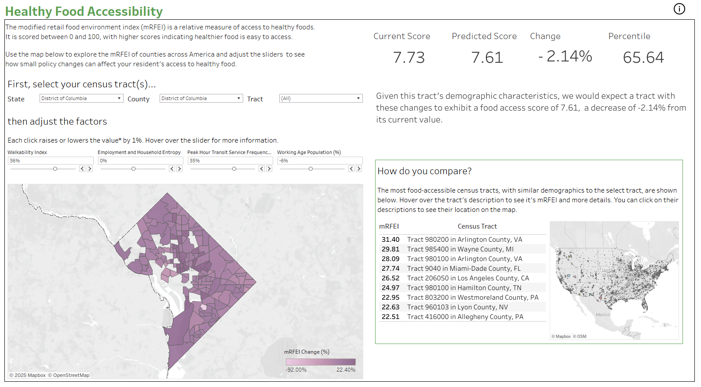

**Team 12 Final Project, Spring 2024    
CSE 6242 Data and Visual Analytics, Georgia Institute of Technology**  

The healthy food accessiblilty dashboard is a tool to provide US policymakers a visual representation of food deserts in their state, county, or census tract of interest. Policymakers may use the dashboard to see how four statistically significant planning metrics may be adjusted to reduce the food desert effect, as measured through the modified Retail Food Environment Index (mRFEI). 

The dashboard and its predictions are powered by a recursive partitioning tree containing 24 terminal nodes, each of which uses a distinct linear regression to predict the effects of our four controllable variables. Census tracts are grouped into nodes based on statistically significant differences in their demographics. Please see the project poster below for more information.  

Python and SQLite were used for data cleaning, while the recursive partition tree was built in R. The interactive dashboard was built in Tableau and can be viewed at the link below:  
[https://public.tableau.com/app/profile/ethan.goldstein/viz/FoodDesertAnalysisDashboard/Dashboard]([https://public.tableau.com/app/profile/ethan.goldstein/viz/FoodDesertAnalysisDashboard/Dashboard)

